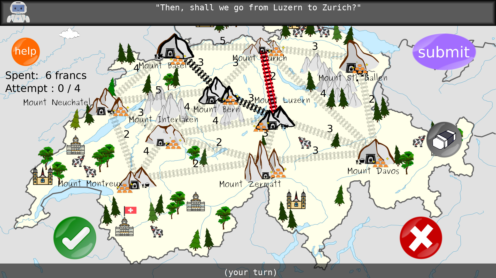
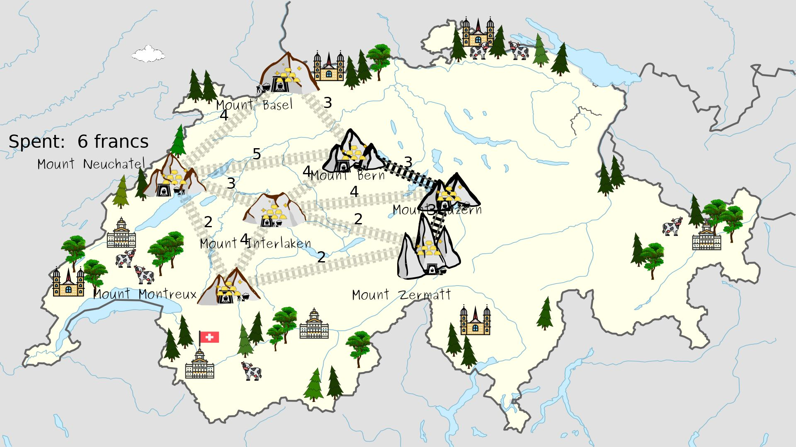
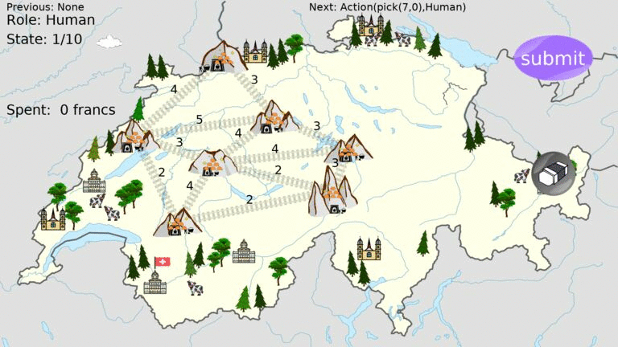

# JUSThink World

[](https://opensource.org/licenses/MIT)


## Overview

This repository contains the [justhink_world] Python package to represent and visualize activities in a pedagogical scenario that contains a human-robot collaborative learning activity for school children, named [JUSThink](https://www.epfl.ch/labs/chili/index-html/research/animatas/justhink/). The scenario aims to improve their computational thinking skills by applying abstract and algorithmic reasoning to solve an unfamiliar problem on networks: it consists of individual (e.g. as in a test for assessment) and collaborative (with an artificial agent e.g. a robot) activities. This code has been used to represent the collaborative activity and the tests in [[1]](#references).

* In an individual activity, a human learner is given a network of rare metal mines with possible positions for railway tracks, where each track if it is built connects one mine to another. The cost of each track is visible. The goal is to collect the rare metal by connecting the rare metal mines to each other, while spending as little as possible to build the tracks.
* In a collaborative activity, the human and the robot as (same-status) peers collaboratively construct a solution to this problem by deciding together which tracks to build, and submit it as their solution to the system. They take turns in suggesting to select/pick a specific connection, where the other either agrees or disagrees with this suggestion. A track will be built only if it is suggested by one and accepted by the other.

The ROS packages to govern a complete human-robot interaction scenario is available at the [justhink-ros] repository. A human learner participates in the pedagogical scenario through an application with the `justhink_scenario` ROS package (in [justhink-ros]). The robot behavior is generated by the `justhink_agent` package (in a robot-generic manner), and manifested by the `justhink_robot` package (i.e. enacted by a particular robot; on e.g. [QTrobot] in our implementation in [justhink-ros]). These are [ROS] nodes that communicate via the custom ROS messages and services defined in `justhink_msgs`.

A `world` in this pacakge ([justhink_world]) is used to represent an activity via describing an interaction between an agent and its environment, following the design principles [here](https://h2r.github.io/pomdp-py/html/design_principles.html) [[2]](#references). Briefly:

* a `state` represents the state of the world: it contains information on the current solution (i.e. the selected connections in the network), the agents that can take actions (for turn-taking), the current attempt number etc.
* an `environment` maintains the state of the world via state transitions defined in a `transition model`.
* an `agent` operates in this environment by taking `action`s, receiving observations (fully observable), and updating its belief.
Furthermore, an agent can list the available actions for a given state via its `policy model`.

The current solution's state for a given activity is an instance of `NetworkState`, as part of the complete specification of the activity state as an `Env(ironment)State` (see [state.py](justhink_world/domain/state.py)). State transitions (i.e. <state, action, next state\> triples) for an individual activity is defined in `IndividualTransitionModel`, and for a collaborative activity in `CollaborativeTransitionModel` (see [transition_model.py](justhink_world/models/transition_model.py)). The action space of the available actions at a given state are determined by `IndividualPolicyModel` and `CollaborativePolicyModel` (see [policy_model.py](justhink_world/models/policy_model.py)).

**Keywords:** artificial intelligence, human-robot interaction, mutual understanding, collaborative learning, computational thinking

### License

The whole package is under MIT License, see [LICENSE](LICENSE).

This README is based on the project [ros_best_practices](https://github.com/leggedrobotics/ros_best_practices), Copyright 2015-2017, Péter Fankhauser. It is licensed under the BSD 3-Clause Clear License. See [doc/LICENSE](doc/LICENSE) for additional details.

**Author: Utku Norman<br />
Affiliation: [CHILI Lab, EPFL](https://www.epfl.ch/labs/chili/)<br />
Maintainer: Utku Norman, utku.norman@epfl.ch**

The [justhink_world] package has been tested under Python 3.8 on Ubuntu 20.04.
This is research code, expect that it changes often and any fitness for a particular purpose is disclaimed.





### Publications

If you use this work in an academic context, please cite the following publication:

* Norman, U., Chin, A., Bruno, B., & Dillenbourg, P. (2022). **Efficacy of a ‘Misconceiving’ Robot to Improve Computational Thinking in a Collaborative Problem Solving Activity: A Pilot Study.** 2022 31st IEEE International Conference on Robot & Human Interactive Communication (RO-MAN). ([PDF](https://infoscience.epfl.ch/record/294825))

        @inproceedings{norman_efficacy_2022,
            title       = {Efficacy of a 'Misconceiving' Robot to Improve Computational Thinking in a Collaborative Problem Solving Activity: A Pilot Study},
            booktitle   = {2022 31st {IEEE} International Conference on Robot \& Human Interactive Communication ({RO}-{MAN})},
            author      = {Norman, Utku and Chin, Alexandra and Bruno, Barbara and Dillenbourg, Pierre},
            month       = aug,
            year        = {2022},
            url         = {https://infoscience.epfl.ch/record/294825},
            urldate     = {2022-07-01},
        }


## Installation

### Building from Source

#### Dependencies

* [pomdp_py](https://h2r.github.io/pomdp-py/html/) to describe the world/problem as an agent interacting with its environment [[2]](#references)
* [networkx](https://networkx.org/) to represent and reason with the networks in an activity
* [pyglet](https://pyglet.readthedocs.io/en/latest/) to visualize and interact with the activity from a role (human or the robot)
* [importlib_resources](https://importlib-resources.readthedocs.io/en/latest/) to access to the resources like the images
* [pqdict](https://pypi.org/project/pqdict/) to implement a priority queue, used in the Prim's algorithm to find a minimum spanning tree for a given network (i.e. the problem we focus on)


#### Building

1) Clone this ([justhink_world]) repository:
```
git clone https://github.com/utku-norman/justhink_world.git
```

2) Create a new [virtual environment](https://docs.python.org/3/tutorial/venv.html) and activate it (can do so in the same folder. Note that the folder name `venv` is [git-ignored](https://git-scm.com/docs/gitignore)):
```
cd justhink_world

python3 -m venv .venv --prompt JUSThink-env

source .venv/bin/activate
```

If you do not have `venv`, first install it by: `sudo apt install python3-venv`

3) Install this package, along with the remaining dependencies via `pip` (in '-e' i.e. editable mode for "developer mode")
```
pip install -e .
```

If you encounter an error regarding Pygraphviz while installing the `pomdp_py` Python package, first install its dependencies (as in [here](https://pygraphviz.github.io/documentation/stable/install.html)): `sudo apt install graphviz graphviz-dev; pip install pygraphviz`

4) Check the installation by running the following in a Python interpreter:
```
from justhink_world import list_worlds, create_all_worlds
worlds = create_all_worlds()
```

## Usage

### Print the list of available worlds and initialize all these worlds.
```
from justhink_world import list_worlds, create_all_worlds

print(list_worlds())

worlds = create_all_worlds()

for name, world in worlds.items():
    print(name, world)
```

### Display an activity state in a window (non-interactive).
```
from justhink_world import create_world, show_state
from justhink_world.domain.action import PickAction

# Create a world.
world = create_world('pretest-1')

# Take actions.
world.act(PickAction((3, 1)))
world.act(PickAction((1, 4)))

# Display the state of the world.
show_state(world.cur_state)
```

You will see a window with two selected edges as follows:





### Try out a world (interactive).

Shortcuts to navigate through and modify the activity:

* Press `ESCAPE` key to close the application,
* Use `LEFT`-`RIGHT` keys to navigate to the previous and the next state respectively,
* Use `HOME`-`END` keys to navigate to the first and the last state of the history respectively,
* Use `P` to toggle pause (i.e. no action is allowed), and `TAB` to toggle the role (between the human and the robot).
* Note that taking an action at a state permanently removes the earlier future history (i.e. all the states that are later than that state), while keeping the previous history (all the states up to that state).

#### Try out an individual (i.e. a test) world.

How to interact with an individual world:

* You can select a connection by clicking on a rare metal mine, dragging to another rare metal mine and releasing on that rare metal mine.
* You can delete all selected connections by pressing the erase button.

##### Visualize an individual world.
```
from justhink_world import create_world, show_world

# Create a world.
world = create_world('pretest-1')

# Visualize the world on the last attached screen (by default).
show_world(world)

## Alternative ways for visualization:
# Visualize the world with drawing mode 'click', i.e. to select connections by consecutively pressing on the nodes.
# show_world(world, drawing_mode='click')

# Visualize the world on the current screen: the default is the last attached screen, e.g. in our case an external touch screen that the student interacts with.
# show_world(world, screen_index=0)
```

From the viewpoint of the robot: i.e. a world where the robot could play the game by itself.
```
from justhink_world import create_world, show_world

world = create_world('robot-individual-1')

show_world(world, drawing_mode='click')
```


##### Execute actions via Python commands (and visualize the world at its latest state).
```
from justhink_world import create_world, show_world
from justhink_world.domain.action import PickAction, ClearAction, \
AttemptSubmitAction, ContinueAction, SubmitAction

# Create a world.
world = create_world('pretest-1')

# Act on the world.
world.act(PickAction((3, 1)))
world.act(PickAction((1, 4)))
world.act(AttemptSubmitAction())
world.act(ContinueAction())
world.act(ClearAction())
world.act(PickAction((5, 6)))

# Visualize the world, from the last state by default.
show_world(world)

# Press escape to exit.

# Take a few more actions.
world.act(AttemptSubmitAction())
world.act(SubmitAction())

# Visualize the world, from the first state, on the current screen.
show_world(world, state_no=1, screen_index=0)
```


##### Render and navigate through an individual world with real log data from a child (for the logs in [[1]](#references)).

```
from justhink_world import create_world, show_world, load_log

world_name = 'pretest-1'

# Load the log table for a sample (i.e. participant index) and activity.
history = load_log(sample_no=1, world_name=world_name)

# Create a world with that history.
world = create_world(world_name, history)

# Display from the first state in the log.
show_world(world, state_no=1)
```

Use `LEFT`-`RIGHT` keys to navigate to the previous and the next state respectively.

The result should be similar to this animation (as if pressing the `RIGHT` key consecutively):




#### Try out a collaborative world.

How to interact with a collaborative world:

* You can suggest selecting a connection by clicking on a rare metal mine, dragging to another rare metal mine and releasing on that rare metal mine.
* You can agree or disagree with a suggestion by the other (robot if you are playing the human role and vice versa) by pressing the agree (check) or disagree (cross) button.


##### Visualize a collaborative world.
```
from justhink_world import create_world, show_world

# Create a world.
world = create_world('collaboration-1')

# Visualize the world
show_world(world)

## Visualize the world on the current screen.
# show_world(world, screen_index=0)
```

##### Execute actions via Python commands (and visualize the world at its latest state).
```
from justhink_world import create_world, show_world
from justhink_world.agent import Agent
from justhink_world.domain.action import SuggestPickAction, \
    AgreeAction, DisagreeAction

# Create a world.
world = create_world('collaboration-1')

# Act on the world.
world.act(SuggestPickAction((3, 1), agent=Agent.ROBOT))
world.act(AgreeAction(agent=Agent.HUMAN))
world.act(SuggestPickAction((1, 4), agent=Agent.HUMAN))
world.act(DisagreeAction(agent=Agent.ROBOT))
world.act(SuggestPickAction((4, 5), agent=Agent.ROBOT))

# Visualize the world, from the last state by default.
show_world(world)
```

##### Render and navigate through a collaborative world with real log data from a child (for the logs in [[1]](#references)).
```
from justhink_world import create_world, load_log, show_world

# Pick a sample (i.e. participant index) and activity.
sample_no = 3
world_name = 'collaboration-1'

# Load the log.
history = load_log(sample_no=sample_no, world_name=world_name)

# Create a world with that history.
world = create_world(world_name, history)

show_world(world, state_no=1)
```


The result should be similar to this animation (as if pressing the `RIGHT` key consecutively):


List available logs.
```
from justhink_world import list_all_logs

list_all_logs()
```


#### Access information about a world/state.

Create a world and print the available actions with human-readible form.
```
from justhink_world import create_world

world = create_world('collaboration-1')

for action in sorted(world.agent.all_actions):
    if hasattr(action, 'edge'):
      u, v = world.env.state.network.get_edge_name(action.edge)
      action = action.__class__(edge=(u, v), agent=action.agent)
    print(action)
```

Get the node name from node id and vice versa.
```
from justhink_world import create_world
world = create_world('collaboration-1')

print(world.env.state.network.get_node_name(1))  # Prints: Luzern

print(world.env.state.network.get_node_id('Luzern'))  # Prints: 1
```

Get the edge's node's names from node id tuple and vice versa.
```
from justhink_world import create_world
world = create_world('collaboration-1')

print(world.env.state.network.get_edge_name((1, 2)))  # Prints: ('Luzern', 'Zurich')

print(world.env.state.network.get_edge_ids(('Luzern', 'Zurich')))  # Prints: (1, 2)
```

Print available actions at the current state (nodes are not human-readible).
```
print(world.agent.all_actions)
```

Print the current state, it's cost and MST cost.
```
state = world.cur_state
print(state, state.network.get_cost(), state.network.get_mst_cost())
```

Show both activity and mental windows:
```
from justhink_world import create_world, show_all

world = create_world('collaboration-1')
# world = create_world('pretest-1')

show_all(world)
```

Print world history.
```
print(world.history)
```

Visualize a mental state for the robot.
```
from justhink_world import create_world, show_mind, show_all

world = create_world('pretest-1')
show_mind(world)
```


## Acknowledgements

This project has received funding from the European Union's Horizon 2020 research and innovation programme under grant agreement No 765955. Namely, the [ANIMATAS Project](https://www.animatas.eu/).

## Bugs & Feature Requests

Please report bugs and request features using the [Issue Tracker](https://github.com/utku-norman/justhink_world/issues).


## References <a name="references"></a>

[1] U. Norman, A. Chin, B. Bruno, and P. Dillenbourg, “Efficacy of a ‘Misconceiving’ Robot to Improve Computational Thinking in a Collaborative Problem Solving Activity: A Pilot Study,” 2022. 31st IEEE International Conference on Robot & Human Interactive Communication (RO-MAN). Accessed: Jul. 01, 2022. [Online]. Available: https://infoscience.epfl.ch/record/294825

[2] Zheng, K., & Tellex, S. (2020). pomdp_py: A Framework to Build and Solve POMDP Problems. arXiv preprint arXiv:2004.10099.


[ROS]: http://www.ros.org
[QTrobot]: https://luxai.com
[justhink_world]: https://github.com/utku-norman/justhink_world
[justhink-ros]: https://github.com/utku-norman/justhink-ros
